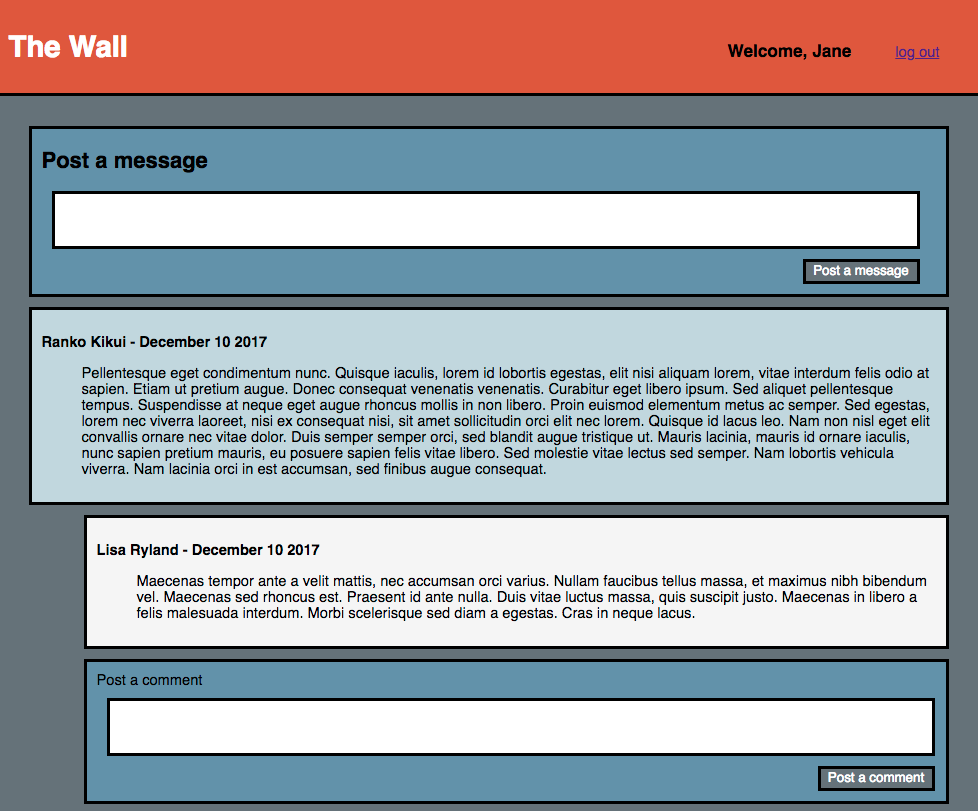

# TheWall-Flask
Social Media website using Python with Flask and mySQL

Features:
- MySQL database
- Registration/login authentication
- Users can post messages on the Wall
- User can comment on messages

